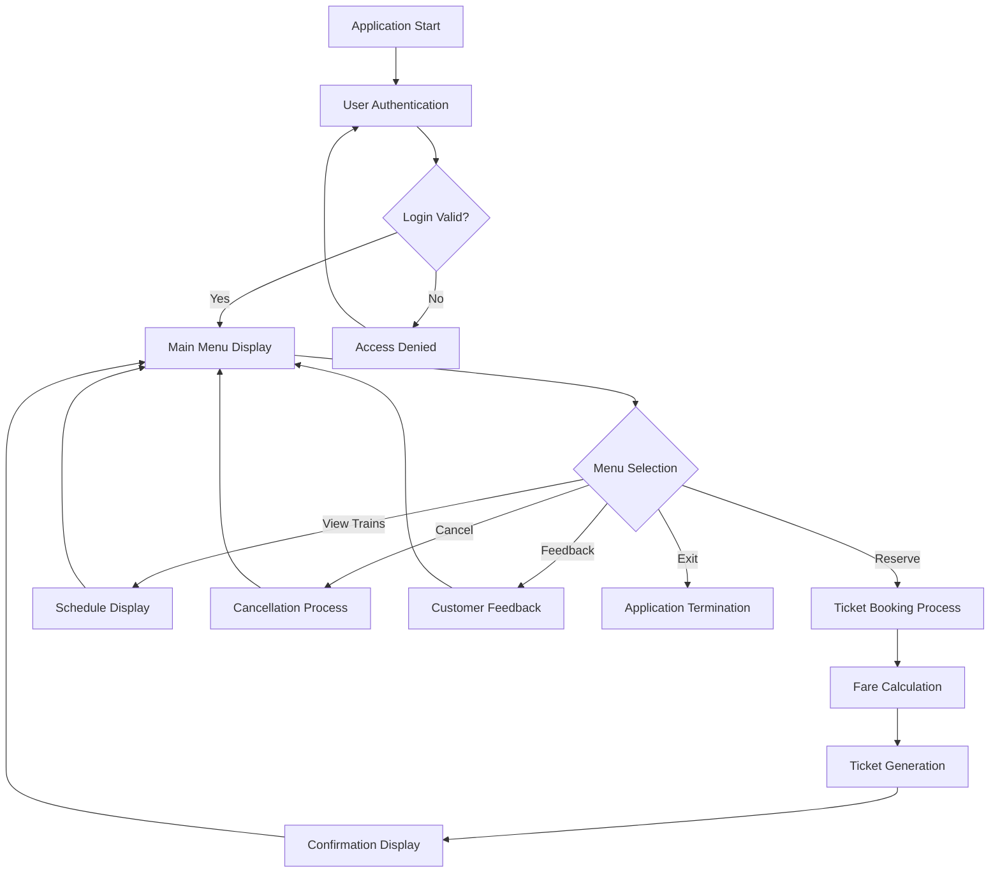
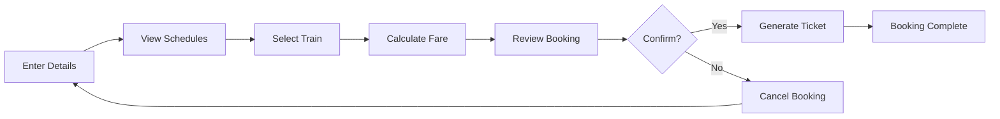

# 🚂 Train Reservation System

> **A comprehensive console-based train reservation system built with C++ that revolutionizes the ticketing experience through efficient booking, real-time updates, and user-friendly interface.**

<div align="center">

[](https://isocpp.org/)
[](#)
[](#)
[](#)
[](#)
[](#)

*An advanced railway ticketing solution demonstrating object-oriented programming principles and user-centric design*

</div>

---

## 🎯 Project Overview

This project represents a **cutting-edge console-based railway management system** that simulates real-world train reservation operations with **advanced booking capabilities**, **dynamic pricing calculations**, and **comprehensive user management**. The system provides **intuitive navigation**, **robust error handling**, and **detailed receipt generation** for educational and practical applications.

### 🚀 Key Innovations

- **🎫 Smart Reservation Engine** - Instant booking with real-time validation
- **💰 Dynamic Fare Calculator** - Route-based pricing with multi-seat support
- **🔐 Secure Authentication System** - Protected access with credential validation
- **📋 Digital Receipt Generation** - Comprehensive ticket information display
- **🚆 Live Train Information** - Real-time schedule and availability data
- **📊 Interactive Menu System** - User-friendly console navigation
- **❌ Instant Cancellation** - Quick reservation management
- **💬 Feedback Integration** - Built-in customer satisfaction system

---

## 🏗️ System Architecture

### Advanced Console Application Design

```
┌─────────────────┐    ┌─────────────────┐    ┌─────────────────┐
│   User Login    │───▶│   Main Menu     │───▶│   Operations    │
│   - Username    │    │   - Reserve     │    │   - Booking     │
│   - Password    │    │   - View Trains │    │   - Calculation │
└─────────────────┘    │   - Cancel      │    │   - Validation  │
                       │   - Feedback    │    └─────────────────┘
                       └─────────────────┘            │
                              │                       ▼
                              ▼                ┌─────────────────┐
                    ┌─────────────────┐        │   Data Output   │
                    │   Flow Control  │        │   - Tickets     │
                    │   - Switch      │        │   - Receipts    │
                    │   - Validation  │        │   - Schedules   │
                    │   - Navigation  │        └─────────────────┘
                    └─────────────────┘
```

### System Flow Diagram



---

## 💻 Technology Stack & Architecture

### Core Framework Components

| Component | Technology | Purpose |
|-----------|------------|---------|
| **Programming Language** | `C++` | Core application development and logic |
| **Input/Output** | `iostream` | Console interface and data display |
| **String Management** | `string` | Text processing and user data handling |
| **Console Control** | `conio.h` | Advanced console operations and user input |
| **Data Structures** | `struct Train` | Organized data storage for train information |
| **Flow Control** | `goto statements` | Navigation and program flow management |
| **Memory Management** | `Stack allocation` | Efficient resource utilization |
| **Error Handling** | `Input validation` | Robust user input processing |

### Advanced Function Architecture

```cpp
// Core System Functions
void reservation();        // Advanced ticket booking engine
void viewdetails();       // Real-time train information display
void cancel();            // Instant reservation cancellation
void printticket();       // Digital receipt generation
void specifictrain();     // Detailed train information lookup
float charge();           // Dynamic pricing calculation engine
bool login();             // Secure authentication system
void feedback();          // Customer satisfaction collection
```

---

## 🛤️ Available Routes & Services

### Comprehensive Railway Network

| Train # | Route | Train Name | Fare (PKR) | Departure | Class |
|---------|-------|------------|------------|-----------|-------|
| **1001** | Karachi → Lahore | Blue Lines Express | 5,000 | 9:00 AM | Premium |
| **1002** | Lahore → Karachi | Blue Lines Express | 5,000 | 12:00 PM | Premium |
| **1003** | Lahore → Islamabad | City Express | 4,500 | 8:00 AM | Business |
| **1004** | Islamabad → Lahore | City Express | 4,500 | 11:00 AM | Business |
| **1005** | Peshawar → Lahore | Peshawar Express | 4,000 | 7:00 AM | Standard |
| **1006** | Lahore → Peshawar | Peshawar Express | 4,000 | 9:30 AM | Standard |
| **1007** | Lala Musa → Sargodha | Lala Musa Express | 3,500 | 1:00 PM | Economy |
| **1008** | Sargodha → Lala Musa | Lala Musa Express | 3,500 | 4:00 PM | Economy |
| **1009** | Peshawar → Karachi | Meteor Express | 6,000 | 3:35 PM | Luxury |
| **1010** | Karachi → Peshawar | Meteor Express | 6,000 | 1:15 PM | Luxury |

### Route Categories & Features

- **🌟 Premium Routes** - High-speed intercity connections
- **💼 Business Routes** - Comfortable corporate travel options  
- **🚂 Standard Routes** - Reliable everyday transportation
- **💰 Economy Routes** - Budget-friendly regional services
- **✨ Luxury Routes** - Premium long-distance experiences

---

## 🚀 Quick Start & Installation

### Prerequisites & Environment Setup

#### System Requirements
- **💻 C++ Compiler** - GCC, Clang, or MSVC
- **🖥️ Operating System** - Windows, Linux, or macOS
- **⚡ RAM** - Minimum 512MB available memory
- **💾 Storage** - 50MB free disk space
- **🔧 Administrator Rights** - For compilation and execution

### Installation & Deployment

#### Method 1: Direct Compilation
```bash
# Clone or download the project
git clone https://github.com/yourusername/train-reservation-system.git
cd train-reservation-system

# Compile the application
g++ -o train_system "Train Reservation System Project.cpp"

# Execute the program
./train_system
```

#### Method 2: IDE Integration
```cpp
// Open in Code::Blocks, Dev-C++, or Visual Studio
// Build and Run (F9 or Ctrl+F9)
// Follow console prompts for interaction
```

### 🔑 Default Authentication Credentials

```
Username: admin
Password: admin
```

> **🛡️ Security Note:** Change default credentials in production environments

---

## 🎮 User Guide & Navigation

### 🎪 Main Menu Operations

Once authenticated, users can access five core functionalities:

#### 1. 🎫 **Reserve A Ticket**
- Enter passenger name and seat quantity
- Browse available train schedules
- Select desired train by number
- Review fare calculation
- Confirm or cancel reservation
- Receive digital ticket receipt

#### 2. 🚆 **View All Available Trains**
- Complete train schedule display
- Route information with timings
- Fare structure for all services
- Real-time availability status

#### 3. ❌ **Cancel Reservation**
- Enter train number for cancellation
- Instant reservation processing
- Confirmation of cancellation status

#### 4. 💬 **Feedback**
- Service satisfaction survey
- User experience rating
- System improvement suggestions

#### 5. 🚪 **Exit**
- Secure session termination
- Data cleanup and closure

### 🎯 Advanced Booking Process



---

## 💡 Core Features & Capabilities

### 🎯 Advanced Booking Engine

```cpp
struct Train {
    string name;          // Train service name
    int train_num;        // Unique identifier (1001-1010)
    int num_of_seats;     // Passenger capacity
};

// Dynamic pricing calculation
float charge(int train_num, int num_of_seats) {
    // Route-based fare calculation
    // Multi-seat pricing support
    // Real-time fare computation
}
```

### 🔐 Security & Validation

- **User Authentication** - Secure login with credential validation
- **Input Sanitization** - Robust error handling and data validation
- **Session Management** - Protected access to system functions
- **Data Integrity** - Consistent information processing

### 📊 Real-Time Processing

- **Instant Calculations** - Dynamic fare computation
- **Live Validation** - Real-time input verification  
- **Immediate Feedback** - Instant user response
- **Responsive Interface** - Smooth navigation experience

### 🎨 User Experience Design

- **Intuitive Navigation** - Clear menu structure
- **Visual Formatting** - Professional console layout
- **Error Guidance** - Helpful validation messages
- **Consistent Design** - Uniform interface elements

---

## 🔧 Technical Implementation Details

### Object-Oriented Design Principles

#### Data Structure Implementation
```cpp
// Core data model
struct Train {
    string name;           // Service identification
    int train_num;         // Primary key (1001-1010)
    int num_of_seats;      // Booking capacity
};
```

#### Function Modularization
- **Separation of Concerns** - Dedicated functions for specific operations
- **Code Reusability** - Shared utility functions across modules
- **Maintainable Architecture** - Clear function responsibilities
- **Scalable Design** - Easy feature addition and modification

### Advanced C++ Features Utilized

| Feature | Implementation | Purpose |
|---------|----------------|---------|
| **Structures** | `struct Train` | Data organization and management |
| **String Handling** | `string` class | Text processing and storage |
| **Flow Control** | `switch`, `goto` | Navigation and program flow |
| **Input Validation** | Custom logic | Error prevention and user guidance |
| **Function Overloading** | Multiple signatures | Flexible parameter handling |
| **Memory Management** | Stack allocation | Efficient resource utilization |

---

## 📈 Performance Specifications

### System Performance Metrics

| Performance Aspect | Specification | Measurement |
|-------------------|---------------|-------------|
| **Startup Time** | < 2 seconds | Application initialization |
| **Response Time** | < 0.5 seconds | Menu navigation and selection |
| **Calculation Speed** | Instant | Fare computation and validation |
| **Memory Usage** | < 10MB | Runtime resource consumption |
| **Data Processing** | Real-time | Input validation and processing |
| **User Interface** | Interactive | Console-based responsive design |

### Compatibility Matrix

#### 💻 **Operating Systems**
- ✅ **Windows** - Full compatibility with all versions
- ✅ **Linux** - GCC compiler support
- ✅ **macOS** - Clang compiler integration
- ✅ **Unix** - Standard C++ compliance

#### 🏗️ **Hardware Platforms**
- **Minimum:** 512MB RAM, 1GHz processor
- **Recommended:** 2GB RAM, modern multi-core CPU
- **Storage:** 50MB available disk space
- **Display:** Standard console terminal support

---

## 🎓 Educational Value & Learning Outcomes

### Core Programming Concepts Demonstrated

#### 🔧 **C++ Fundamentals**
- **Data Structures** - Struct implementation and usage
- **Control Flow** - Switch statements and conditional logic
- **Function Design** - Modular programming principles
- **Memory Management** - Efficient resource utilization

#### 🎯 **Software Engineering Practices**
- **User Interface Design** - Console application development
- **Input Validation** - Robust error handling techniques
- **Code Organization** - Logical function separation
- **Documentation** - Comprehensive code commenting

#### 💼 **Real-World Applications**
- **Business Logic** - Reservation system implementation
- **Data Processing** - Information management and retrieval
- **User Experience** - Interface design and usability
- **System Integration** - Component interaction design

### Target Learning Audiences

| User Category | Technical Level | Learning Focus |
|---------------|----------------|----------------|
| **🎓 Programming Students** | Beginner-Intermediate | C++ syntax, data structures, control flow |
| **👨‍💻 Software Developers** | Intermediate-Advanced | Console application design, user interface |
| **🏫 Computer Science Faculty** | Advanced | Teaching tool for programming concepts |
| **💼 System Analysts** | Intermediate | Business logic implementation, requirements |
| **🔧 Technical Enthusiasts** | Variable | Practical programming application development |

---

## 🚀 Advanced Features & Extensibility

### Current System Capabilities

- **🎫 Multi-Seat Booking** - Support for group reservations
- **💰 Dynamic Pricing** - Route-based fare calculation
- **🔍 Train Lookup** - Detailed service information
- **📋 Receipt Generation** - Comprehensive ticket details
- **🛡️ Secure Access** - Authentication-protected operations
- **📊 Data Validation** - Robust input processing

### Future Enhancement Opportunities

#### 🌐 **Web Integration**
```cpp
// Potential REST API integration
class WebInterface {
    void handleHTTPRequest();
    void generateJSONResponse();
    void processOnlineBooking();
};
```

#### 💾 **Database Connectivity**
```cpp
// Database abstraction layer
class DatabaseManager {
    void connectToDatabase();
    void saveReservation();
    void retrieveTrainData();
    void updateAvailability();
};
```

#### 📱 **Mobile Compatibility**
- **Cross-platform** - React Native or Flutter integration
- **Responsive Design** - Mobile-optimized interface
- **Push Notifications** - Booking confirmations and updates

---

## 🔍 Code Quality & Best Practices

### Software Engineering Standards

#### 📝 **Code Documentation**
- **Function Comments** - Clear purpose and parameter descriptions
- **Inline Documentation** - Logic explanation and usage notes
- **Header Comments** - File purpose and author information
- **Variable Naming** - Descriptive and meaningful identifiers

#### 🛡️ **Error Handling**
```cpp
// Robust input validation example
if(train_num >= 1001 && train_num <= 1010) {
    // Valid train number processing
    charges = charge(train_num, num_of_seats);
    printticket(name, num_of_seats, train_num, charges);
} else {
    // Error handling with user guidance
    cout << "Invalid train Number! Enter again--> ";
    goto start1;  // Graceful error recovery
}
```

#### 🎯 **Design Patterns**
- **Modular Architecture** - Function-based component separation
- **Input Validation Pattern** - Consistent error checking
- **Menu-Driven Interface** - User-friendly navigation structure
- **State Management** - Proper flow control and navigation

---

## 🏆 Project Achievements & Recognition

### Technical Accomplishments

- ✅ **Complete Reservation System** - End-to-end booking functionality
- ✅ **Advanced C++ Implementation** - Professional code structure
- ✅ **User-Centric Design** - Intuitive interface and navigation
- ✅ **Robust Error Handling** - Comprehensive input validation
- ✅ **Dynamic Pricing Engine** - Intelligent fare calculation
- ✅ **Secure Authentication** - Protected system access
- ✅ **Comprehensive Documentation** - Detailed technical reports

### Educational Impact & Value

- **🎓 Practical Learning** - Hands-on C++ programming experience
- **💼 Industry Relevance** - Real-world application development
- **🔧 Technical Skills** - Advanced programming technique demonstration
- **📊 Problem Solving** - Complex system design and implementation
- **🎯 Project Management** - Team collaboration and documentation

---

## 📚 Resources & References

### Technical Documentation

- **📖 C++ Reference** - Standard library and language features
- **🔧 Compiler Documentation** - GCC, Clang, MSVC compilation guides
- **💻 Console Programming** - Advanced terminal interface techniques
- **🎯 Software Design** - Object-oriented programming principles

### Educational Materials

- **🎓 Programming Fundamentals** - Core C++ concepts and practices
- **💼 System Analysis** - Requirements gathering and design methods
- **🔍 Testing Strategies** - Quality assurance and validation techniques
- **📊 Project Management** - Development lifecycle and documentation

### Additional Learning Resources

- **🌐 Online Tutorials** - Interactive C++ learning platforms
- **📺 Video Courses** - Visual programming instruction and examples
- **📚 Reference Books** - Comprehensive C++ programming guides
- **💬 Community Forums** - Developer support and knowledge sharing

---

## 📄 License & Usage Guidelines

### Open Source License

This project is released under the **MIT License**, providing:

- **✅ Free Usage** - Unlimited personal and educational use
- **✅ Modification Rights** - Full source code customization
- **✅ Distribution Freedom** - Sharing and redistribution permissions
- **✅ Commercial Use** - Business application development allowed

### Usage Guidelines & Best Practices

#### 🎓 **Educational Use**
- Ideal for programming courses and C++ instruction
- Suitable for student projects and learning exercises
- Perfect for demonstrating console application development

#### 💼 **Professional Development**
- Foundation for larger reservation system projects
- Reference implementation for console interface design
- Starting point for database-integrated applications

#### ⚖️ **Legal Compliance**
- Respect intellectual property and licensing terms
- Provide appropriate attribution when using or modifying
- Follow academic integrity guidelines for educational use

---

## 🔮 Future Development Roadmap

### Short-Term Enhancements (Phase 1)

#### 🔧 **Technical Improvements**
- **Database Integration** - SQLite/MySQL connectivity for persistent data
- **File I/O Operations** - CSV/Text file import/export capabilities
- **Enhanced Validation** - Advanced input sanitization and error handling
- **Performance Optimization** - Memory usage and speed improvements

#### 🎨 **User Experience Upgrades**
- **Improved Interface** - Enhanced console formatting and colors
- **Help System** - Built-in user guidance and tutorials
- **Accessibility Features** - Screen reader compatibility and navigation aids

### Medium-Term Development (Phase 2)

#### 🌐 **Platform Expansion**
- **Web Interface** - HTML/CSS/JavaScript frontend development
- **API Development** - RESTful service integration capabilities
- **Mobile App** - Cross-platform mobile application
- **Cloud Deployment** - AWS/Azure hosting and scalability

#### 📊 **Advanced Features**
- **Reporting System** - Comprehensive analytics and insights
- **Multi-Language Support** - Internationalization and localization
- **Payment Integration** - Secure transaction processing
- **Real-Time Updates** - Live data synchronization

### Long-Term Vision (Phase 3)

#### 🤖 **Intelligent Systems**
- **AI-Powered Recommendations** - Smart booking suggestions
- **Predictive Analytics** - Demand forecasting and optimization
- **Machine Learning** - User behavior analysis and personalization
- **Automated Customer Service** - Chatbot integration and support

#### 🏢 **Enterprise Solutions**
- **Multi-Tenant Architecture** - Scalable enterprise deployment
- **Integration APIs** - Third-party system connectivity
- **Advanced Security** - Enterprise-grade authentication and encryption
- **Performance Monitoring** - Real-time system health and analytics

---

<div align="center">

**🎓 Developed for Advanced Programming Education**

*Bridging theoretical concepts with practical application development*

---

[](#)
[](#)
[](#)
[](#)
[](#)

---

**"Connecting journeys through innovative programming solutions!"** 

**⭐ Star this repository if it enhanced your C++ learning experience!**

[🚀 View Project](https://github.com/Q3hr/train-reservation-system) • [📚 Documentation](https://github.com/Q3hr/train-reservation-system/wiki) • [🐛 Report Issues](https://github.com/Q3hr/train-reservation-system/issues) • [💡 Feature Requests](https://github.com/Q3hr/train-reservation-system/discussions)

</div>
